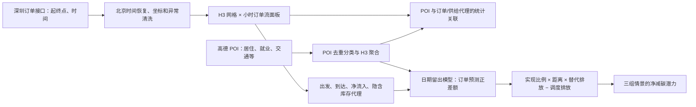
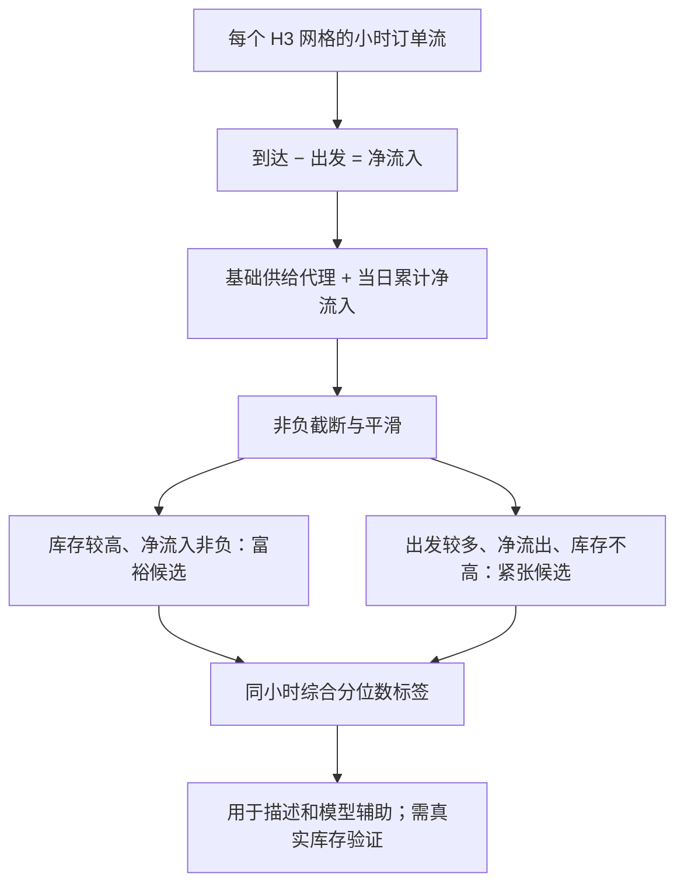
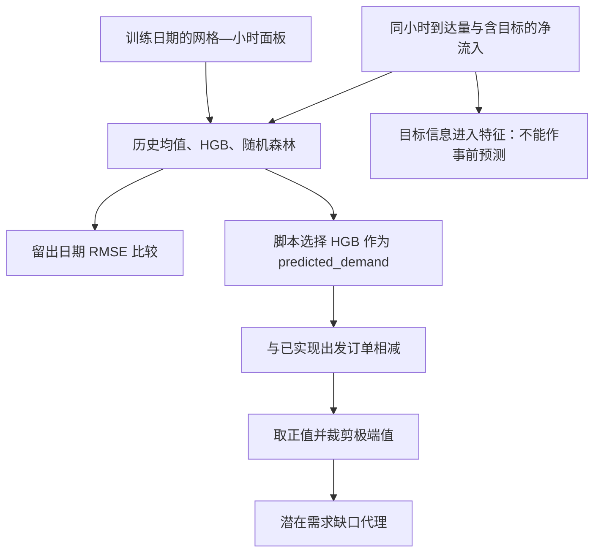
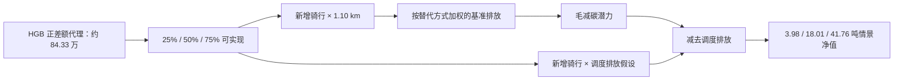

# 研究导读：深圳共享单车订单流、供给代理与情景化减碳

这份导读按[匿名提交版论文](../paper/submitted_paper.pdf)的研究链条组织，便于在 GitHub 无法预览 PDF 时阅读。它说明每一部分的研究问题、指标和模型机制、主要结果、对应代码，以及论文文字与提交脚本之间需要区别的口径。完整论证、图表与参考文献仍以论文为准。

## 整体研究问题与数据边界

公开订单记录只包含**已经发生的骑行**，没有某一时刻可用车辆数、找车失败或调度日志。论文由此采取递进式代理框架：先描述订单流，再用订单净流入构造供给状态代理；用 POI 解释网格差异；以订单预测正差额构造“潜在需求缺口代理”；最后在明确的交通替代假设下计算情景化减碳潜力。后面三层都不能被直接当作真实库存、未成交订单或核证减排量。



主分析期为 **2021 年 8 月 20—28 日，共 9 日**。8 月 29—30 日接口返回量明显偏低，论文将其排除。清洗后共有 **13,915,910 单**、**2,854 个**活跃 H3 网格，完整网格—小时面板 **616,464 行**。论文给出的订单加权平均直线距离为 **1.103 km**。这些是全样本口径；后续建模筛选后的行数和订单合计不同。

## 一、数据处理：让订单时间、坐标和网格对齐

原接口可能返回只有日内时间的字段。处理时把接口日期与时间拼成完整时间戳，统一按北京时间解释，并识别跨日订单。原提交配置的坐标系是 BD-09；先转换为 WGS-84，再映射到 H3。对坐标、时长、距离、速度等异常记录做筛除。由于没有真实 GPS 轨迹，距离采用起终点球面直线距离，因此可能低估真实骑行里程。

对每个网格、日期和小时分别计数：

```text
出发订单 orders_out = 起点落入该网格、该小时的订单数
到达订单 orders_in  = 终点落入该网格、该小时的订单数
净流入 net_flow     = orders_in − orders_out
```

负净流入表示该时段车辆随骑行净流出，正净流入表示净流入；二者都只反映**已实现订单产生的移动**，还会受企业调度影响。主面板按活跃网格和每小时补齐，保留无订单的网格—小时，便于比较不同时段。

主要代码入口为 [bike_pipeline_part1_stable_api.py](../code/bike_pipeline_part1_stable_api.py)：**parse_time_series / apply_source_timezone** 恢复北京时间；**clean_chunk / convert_coords** 清洗并转换坐标；**aggregate_chunk / finalize_panel** 生成起点、终点与净流入面板；**run_pipeline** 按日调用接口和汇总。POI 获取脚本 [amap_poi_fetch_shenzhen_economy.py](../code/amap_poi_fetch_shenzhen_economy.py) 完成分类、去重和坐标归一。公开仓库没有带密钥的原配置或原始接口数据。

## 二、订单流与供给状态代理

论文首先按日内六个时段看订单的时间分布：0—5 时夜间低谷、6 时早高峰前、7—9 时早高峰、10—16 时日间平峰、17—19 时晚高峰、20—23 时夜间尾段。空间上再对照起点订单、夜间净流入和早高峰前状态，寻找车辆可能沉淀或快速净流出的网格。

没有真实期初库存时，论文以网格历史活跃度构造基础供给量，再把当天截至该小时的净流入累加，取非负部分作为“隐含库存代理”：

```text
隐含库存代理(i, d, t)
  = max(基础供给代理(i) + 当天 0…t 时净流入之和, 0)
```

累计在每天重新开始，避免把九天误差不断滚到下一天。之后结合库存代理、净流入和出发订单的相对位置：同一时段库存代理偏高、净流入非负且综合富裕程度居前 25% 的网格—小时记为**供给富裕代理**；出发订单较高、净流出明显、库存代理不高于活跃网格中位数且综合紧张程度居前 25% 的记为**供给紧张代理**。分位数标签只服务于空间比较，不能证明某网格真的有车或缺车。



[bike_stage2_research_ready_v3.py](../code/bike_stage2_research_ready_v3.py) 的 **recompute_inventory** 重新计算日内累计库存代理，**check_daily_completeness** 检查日期与小时覆盖，**add_lag_features** 构造历史订单项，**build_poi_grid_features** 连接 POI 与网格，**run** 组织研究面板。部分实现在第一阶段已完成，第二阶段保留复核及建模特征处理。

## 三、POI 与订单强度、供给代理的统计关联

高德 POI 经去重、归类并映射到 H3 网格；居住、办公/产业、商业消费、地铁、公交、教育等类别按网格计数，再用 **log(1 + 数量)** 缓和极端中心网格的影响。POI 是空间功能指标，不能直接代表居民人数、出行目的或某项设施的因果作用。

出发订单是非负计数。论文比较 Poisson 与负二项模型：Poisson 的条件方差等于条件均值，而实际订单高度集聚；负二项模型允许方差高于均值。**493,776 行**建模样本中，Poisson 的 Pearson χ²/df 约 **5.35**，AIC **3,599,460.35**；负二项 AIC **2,250,013.50**，因此论文把负二项作为订单强度主模型。居住、公交、办公/产业、地铁和教育 POI 的条件相关方向为正；商业消费变量在多变量模型中为负向净效应，可能受功能重叠与共线性影响，不能读作“商业区不需要单车”。

供给代理部分使用 L2 正则化 Logistic 辅助区分富裕与紧张标签。论文报告的 ROC-AUC 分别约 **0.846** 和 **0.655**。脚本使用分层随机行划分；同一网格可在训练和测试中反复出现，且标签本来就来自订单流构造，因此这些 AUC 只描述当前样本代理标签的可分性，不能代表新城市或未来时段的真实库存识别能力。

[bike_stage3b_refined_models_v2.py](../code/bike_stage3b_refined_models_v2.py) 中，**prepare_data** 整理 POI 和控制变量；**run_poisson_reduced / run_negative_binomial** 产生计数模型及诊断；**run_regularized_logistic** 对两类供给代理建模；**make_model_comparison** 汇总模型。原提交包缺少生成 Stage 3 变换面板的脚本，虽然保留了该中间面板；公开仓库未上传大型面板，单靠本仓库不能从原始订单完整重跑。

## 四、订单预测正差额与“潜在需求缺口”

预测目标是网格—小时出发订单。论文按**日期**划分 8 月 20—26 日训练、8 月 27—28 日测试，比较网格同小时历史均值、HistGradientBoosting 和随机森林。进入 Stage 4 的候选面板为 **493,776 行**；实际模型拟合 **289,215 行**，测试 **109,728 行**。训练时还剔除供给紧张代理时段和短缺压力最高的一部分记录，目的是少学习可能受供给约束的低订单状态。

| 测试集模型 | RMSE，订单/网格—小时 | 正确解读 |
| --- | ---: | --- |
| 历史网格—小时均值 | 29.52 | 原流程中的基线 |
| HistGradientBoosting | 17.13 | 比该基线低，但不是前瞻部署误差 |
| 随机森林 | 14.86 | 三者最低；论文文字称用它构造缺口 |

**论文与脚本有一处实质差异：**论文第 5 章写“基于随机森林模型得到预测需求基准”；然而提交版 [Stage 4 脚本](../code/bike_stage4_demand_gap_v2.py) 第 463 行把 **pred_hgb** 赋给 **predicted_demand**，随后用它计算 **unmet_demand_proxy**；[Stage 5 脚本](../code/bike_stage5_carbon_scenarios_v2.py) 又直接读取该字段。因此，公开代码链路中的缺口和情景碳量来自 **HistGradientBoosting**，不能把随机森林的 14.86 RMSE 当作碳量计算的预测器指标。仓库保留了提交脚本，没有擅自改换预测器或重算结果。

代码先计算正差额，再将其在候选面板内裁剪到 99.5% 分位数，以减轻极端残差影响：

```text
原始正差额 = max(predicted_demand − actual_demand, 0)
缺口代理   = min(原始正差额, 原始正差额的 99.5% 分位数)
```

更关键的限制是，Stage 4 特征包含**同一小时到达订单 orders_in**，以及 **|net_flow| = |orders_in − orders_out|** 的变换。后者直接含有待预测的出发订单。虽然训练和测试日期分开，这些信息在事前预测时不可用，且目标会进入特征；所以测试 RMSE 是原流程的**回顾性拟合诊断**，不应解释成未来预测能力。正差额也可能来自模型误差、天气、活动和平台调度，不是已证实的缺车订单。



[bike_stage4_demand_gap_v2.py](../code/bike_stage4_demand_gap_v2.py) 的 **make_train_test_split** 做日期隔离和稳定时段筛选，**build_feature_matrix / baseline_grid_hour_mean / fit_hgb / fit_rf_optional** 构造模型，**run** 计算三种 RMSE、选择脚本的主预测并输出缺口面板。

## 五、由缺口代理到减碳情景

论文假设一部分“缺口代理”可通过调度等方式转为新增骑行，并设定它替代了不同份额的私家车、出租车、公交、地铁、电动车或步行。各方式排放经情景加权为单位替代排放强度；再扣除为新增骑行所需调度的简化排放。基准距离 **1.10 km** 来自 1.103 km 样本均值的近似，Stage 5 表中固定使用这一距离。若实际替代的是步行或低排放方式，减碳潜力会相应下降。

```text
新增实现骑行 = 缺口代理 × 情景实现比例
毛减碳量     = 新增实现骑行 × 1.10 km × 加权替代排放强度
调度排放     = 新增实现骑行 × 每次新增骑行的调度排放假设
净减碳潜力   = max(毛减碳量 − 调度排放, 0)
```

| 情景 | 实现比例 | 加权替代排放，kg CO₂/km | 调度排放，kg/新增骑行 | 毛减碳，吨 | 净减碳，吨 |
| --- | ---: | ---: | ---: | ---: | ---: |
| 保守 | 25% | 0.04442 | 0.030 | 10.30 | **3.98** |
| 中性 | 50% | 0.06155 | 0.025 | 28.55 | **18.01** |
| 积极 | 75% | 0.07820 | 0.020 | 54.41 | **41.76** |

提交结果表里的缺口代理合计约 **843,309 单**，碳情景面板包含 **493,776 行**、已实现出发订单合计 **13,915,095 单**。这是经过下游模型筛选后的面板，与前述全样本 **13,915,910 单**相差 **815 单**，两者不能混作同一个样本分母。中性情景下，日间平峰净量约 **4.85 吨**最高；按单位小时，晚高峰约 **1.47 吨/小时**最高。论文还在 0.94、1.20、1.73、2.00 km 下做距离敏感性分析；这只检验参数变化，不验证替代关系或真实调度排放。



[bike_stage5_carbon_scenarios_v2.py](../code/bike_stage5_carbon_scenarios_v2.py) 的 **prepare_panel / compute_scenarios** 读取 Stage 4 缺口并逐情景计算，**scenario_summary** 汇总碳量，**sensitivity_summary** 改变距离假设。三组参数保存在 [stage5_scenario_assumptions.csv](../results/stage5_scenario_assumptions.csv)；结果保存在 [table_05_stage5_scenario_summary.csv](../results/table_05_stage5_scenario_summary.csv)。[bike_stage6_robustness_archive.py](../code/bike_stage6_robustness_archive.py) 汇总论文表；公开版仅修正它从测试行读取 RMSE 的逻辑，详见[方法与结果核对](method_notes.md)。

## 如何使用这份研究结果

- 可把订单流、净流入、POI 关联和情景图看作**进一步实地核查的线索**。要识别真实供给不足，需要可用车库存、找车失败、开锁失败及调度记录。
- 目前的 Stage 4 特征设计、论文与代码预测器不一致、只有九天样本，限制了对缺口总量和减碳数值的解释。任何前瞻应用都应重新定义决策时可得特征、按时间重做完整回测、再由外部数据验证未满足需求。
- POI 的计数模型和 Logistic 只估计条件关联；情景碳量依赖新增骑行是否发生、替代交通方式、距离及调度排放的设定。它不是因果减排估计或碳核证量。
- 原始接口数据、大型中间面板、密钥配置均未公开。完整输入依赖与运行顺序见[复现说明](reproduce.md)，数据来源见[数据说明](../data/README.md)。
