# 共享单车潜在需求缺口与情景化减碳潜力研究

> 阅读提示：推荐使用[静态阅读页](https://chengyun249.github.io/bikeshare-demand-carbon-shenzhen/paper/article.html)查看完整正文、图片和公式。如果当前 GitHub 页面未显示插图，可点击每幅图下方的“打开原图”；公式另见[源码索引](equations_source.md)。

## 摘要

在国家推动绿色低碳转型与城市交通高质量发展的战略背景下，共享单车作为短距离出行与公共交通接驳的关键工具，对完善城市交通网络、降低出行碳排放具有重要作用。但当前共享单车系统存在供需时空错配问题。在平台数据壁垒，实时车辆库存、找车耗时等微观行为数据难以获取，潜在骑行需求因车辆缺位无法转化为实际订单，导致需求识别精度不足的约束下，如何基于公开数据构建精准化供需预测框架，提升共享单车时空匹配效率与低碳服务能力，成为城市交通治理领域的重要问题。

在此背景下本文以深圳市为研究区域，结合共享单车全天订单流数据与高德POI城市功能数据，构建H3网格—小时尺度的精细化分析面板，形成“订单流刻画—供给状态代理—POI机制解析—潜在缺口识别—情景化减碳测算”的递进式研究路径。首先基于出发、到达与净流入指标构建车辆隐含库存代理，识别车辆沉淀与供给紧张区域；其次采用负二项计数模型与正则化Logistic模型，揭示居住、办公、地铁等POI功能对订单强度与供给状态的影响机制；进一步运用随机森林机器学习模型构建预测需求基准，识别未被满足的潜在需求缺口；最后设置多情景核算需求优化释放后的净减碳潜力，形成数据受限条件下共享单车供需与减碳潜力的一体化分析框架。

研究结果表明，深圳共享单车订单呈现显著的早晚高峰与空间集聚特征，居住、地铁等POI是驱动骑行需求的核心要素；潜在需求缺口主要集中于轨道接驳、居住与就业密集区域，且晚高峰单位小时减碳强度最高。在1.10km基准骑行距离下，保守、中性与积极情景净减碳潜力分别为3.98吨、18.01吨与41.76吨CO₂。本文研究可为共享单车分时段差异化调度、按功能区精准投放、高潜力区域优先治理提供依据，并为同类城市在数据约束下开展慢行交通供需优化与低碳潜力评估提供参考，助力城市交通绿色低碳转型与“双碳”战略落地。

关键词：共享单车；潜在需求缺口；POI机制；H3 网格；减碳潜力

## 一、问题提出与研究思路

### （一）研究背景

在“双碳”目标和城市绿色低碳转型持续推进的背景下，交通运输领域节能降碳已成为城市治理的重要内容，短距离出行与公共交通接驳也逐渐成为影响交通效率与碳排放结构的重要环节[1]。共享单车因其使用灵活、覆盖范围广以及直接排放较低等特征，在城市交通体系中承担着“最后一公里”连接的重要功能[2]。在一定条件下，其不仅可以补充轨道交通与公交系统的接驳能力，也可能替代部分短距离机动化出行，从而在整体交通系统中体现出一定的低碳潜力。

但是这种低碳潜力并不会自动实现。从实际运行情况来看，共享单车系统往往受到供需时空错配的制约：在早晚高峰时段，一些需求较为集中的区域可能出现车辆不足，而在需求较低区域则可能出现车辆闲置。这种不匹配不仅影响用户出行体验，也可能通过额外调度带来新的排放。因此，从供需匹配角度理解共享单车运行状态，是评估其交通效率与环境效益的关键[3]。

从数据可获得性来看，准确刻画共享单车供给状态通常需要实时车辆库存、车辆可用性、用户搜索行为、开锁失败记录以及企业调度日志等数据。然而，这类数据多属于平台内部信息，在公开研究中较难获取。相比之下，订单数据虽然只反映已实现的骑行行为，但能够在一定程度上揭示需求分布及车辆流动方向。因此，在缺乏直接观测数据的条件下，如何基于订单流构建供给状态代理，并进一步识别潜在需求缺口，成为本文研究的出发点。

### （二）研究问题

本文以深圳市共享单车系统为研究对象。作为高密度发展城市，深圳具备完善的轨道交通网络和较为活跃的共享单车使用环境，为分析订单流特征与城市功能关系提供了良好的研究场景。围绕上述背景，本文主要关注以下问题：

深圳共享单车订单在全天尺度上呈现出怎样的时间与空间分布特征？

在缺乏实时库存数据的条件下，如何基于订单流构建供给状态代理？

不同类型POI所反映的城市功能如何影响订单强度？

预测需求与实际订单之间的差额，能否用于刻画潜在未满足需求，并进一步用于减碳潜力估算？

上述问题在逻辑上相互衔接，是本文的行文基础：首先识别订单流与供给状态特征，其次解释其空间机制，然后在此基础上进一步构建潜在需求缺口代理，最终将其转化为情景化减碳潜力。

### （三）研究思路与技术路线

本文整体采用“数据处理—订单流分析—机制解释—缺口识别—情景估算”的分析路径。具体而言，首先将订单起终点映射至H3网格，构建网格—小时面板数据；在此基础上，通过出发订单、到达订单及净流入刻画订单流特征，并构建供给状态代理；随后引入POI变量，从城市功能角度解释订单强度差异；进一步利用预测模型构建需求基准，并识别潜在未满足需求代理；最后结合不同情景设定，对潜在需求释放的减碳潜力进行估算。

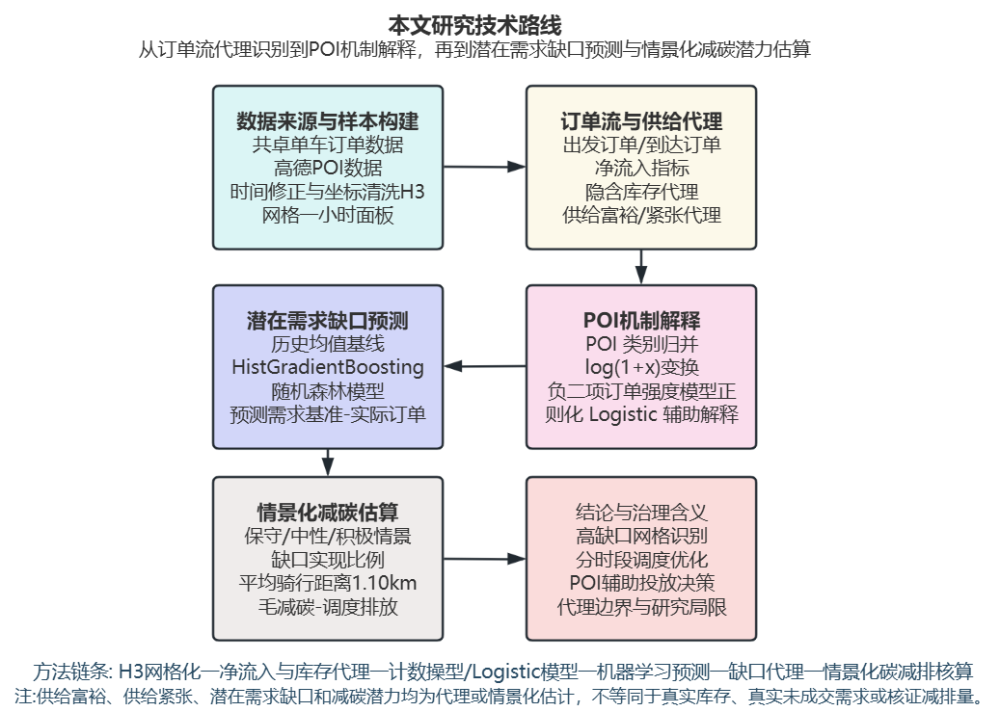

[打开原图：正文插图 1](https://chengyun249.github.io/bikeshare-demand-carbon-shenzhen/paper/images/figure_01.png)

**图1  本文技术路线**

### （四）研究边界

在解释结果时，需要区分“代理指标”与“真实状态”。首先，供给富裕与供给紧张指标来源于订单流与库存代理，并不等同于真实车辆库存；其次，潜在需求缺口基于预测需求与实际订单的差额构建，其本质是模型意义上的正向残差，而非真实未成交需求；再次，减碳估算依赖于情景参数设定，包括需求实现比例、骑行距离及替代关系等，因此不应被理解为核证减排量。

需要强调的是，这种代理框架并非对真实系统的完全还原，而是在数据受限条件下，对供需关系进行可解释刻画的一种近似方法。其主要价值在于提供相对比较和空间识别，而非精确测量。

## 二、数据来源与指标构建

### （一）数据来源与样本口径

本文使用两类数据。第一类为深圳市共享单车订单数据[4]，字段包括订单开始时间、结束时间、起点经纬度和终点经纬度。第二类为高德 POI 数据[5]，反映不同网格内的城市功能场所分布，包括居住、办公/产业、商业消费、地铁、公交、教育、医疗、公共服务、休闲游憩和其他交通等类别。

订单数据通过接口按日期获取。由于原始时间字段为日内时间，本文将接口日期与时间字段进行拼接，统一构建完整时间戳，并按北京时间解释。

主分析样本为 2021年8月20日至2021年8月28日，共9个完整分析日。 2021年8月29日和8月30日存在接口返回量明显偏低问题，因此不纳入主分析样本。经过时间恢复、坐标清洗、异常订单过滤和H3网格聚合后，本文形成清洗后订单13,915,910单，H3 活跃网格2,854个，网格—小时面板616,464行。

**表1  主分析样本概况**

| 指标 | 数值 |
| --- | --- |
| 主分析日期 | 2021-08-20 至 2021-08-28 |
| 主分析日期数 | 9 日 |
| 清洗后出发订单数 | 13,915,910 单 |
| H3 活跃网格数 | 2,854 个 |
| 网格—小时面板行数 | 616,464 行 |
| 订单加权平均骑行距离 | 1.103 km |
| 网格小时平均骑行距离中位数 | 1.197 km |
| 网格小时平均骑行距离 P25–P75 | 0.936–1.726 km |

本文采用 H3 网格作为空间分析单元[6]，主要原因是六边形网格相较行政区能够更细致地刻画共享单车订单的局部集聚与净流动方向，并能够避免行政边界尺度过粗导致的空间平均化问题。本文仅保留样本期内具有订单活动的活跃网格，最终形成 2,854 个活跃 H3 网格。由于网格尺度仍会影响热点识别和模型结果，本文将相关结论解释为当前空间尺度下的网格化代理结果。

### （二）数据处理流程

数据处理主要包括时间恢复、异常值清理和空间聚合。首先对订单时间进行标准化处理，并识别跨日订单；其次剔除坐标异常记录，并计算起终点球面距离；随后将订单映射至H3网格，并按“网格—小时”进行聚合；最后将POI数据进行分类整理后映射至同一空间单元，并与订单数据合并。

需要指出的是，由于缺乏实际骑行轨迹，本文采用球面距离作为骑行距离近似，这一处理可能低估真实出行距离。因此，在后续减碳分析中引入距离敏感性分析，以降低该误差影响。

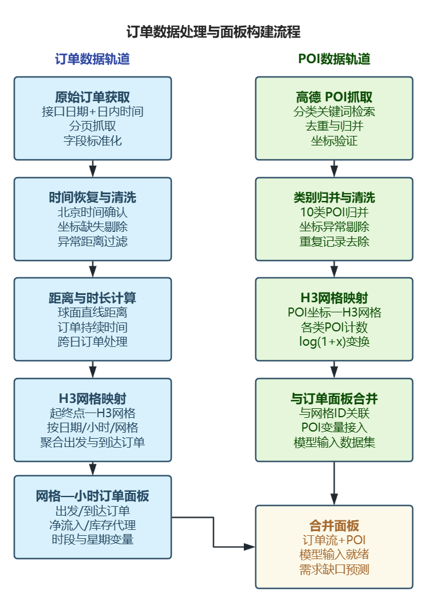

[打开原图：正文插图 2](https://chengyun249.github.io/bikeshare-demand-carbon-shenzhen/paper/images/figure_02.png)

**图2  数据处理与面板构建流程**

### （三）订单流基础指标

本文以 H3网格—小时为基本分析单元。设网格为 i， 日期为 d，小时为 t。

网格 i在日期 d、小时 t的出发订单数记为 $`O^{out}_{i,d,t}`$ ，到达订单数记为 $`O^{in}_{i,d,t}`$。二者分别反映该网格在特定小时产生骑行需求和吸收车辆到达的能力。

净流入指标定义为：

```math
NF_{i,d,t}=O^{in}_{i,d,t}-O^{out}_{i,d,t}\tag{1}
```

当 $`NF_{i,d,t}`$ > 0时，说明该网格在该小时到达订单多于出发订单，表现为车辆净流入；当 $`NF_{i,d,t}`$< 0时，说明出发订单多于到达订单，表现为车辆净流出。净流入是识别车辆沉淀、供给富裕和供给紧张代理的基础变量。

骑行距离采用起终点球面直线距离近似计算。设订单 k 的骑行距离为 dk，则订单加权平均骑行距离为：

```math
\bar d=\frac{1}{N}\sum_{k=1}^{N}d_k\tag{2}
```

基于清洗后订单计算，本文得到订单加权平均骑行距离为1.103 km。为保证减碳估算参数来源于样本数据，后续情景测算采用1.10 km作为基准平均骑行距离。

### （四）供给状态代理

由于缺乏实时车辆库存数据，本文基于订单流构建隐含库存代理。设Bi  表示网格i的基础供给水平，本文根据网格历史订单活跃度构造。则日期d内网格 i截至小时 t的隐含库存代理为：

```math
S_{i,d,t}=\max\left(B_i+\sum_{r=0}^{t}NF_{i,d,r},\,0\right)\tag{3}
```

式(3)强调库存代理按日内累计，而不是跨日期无限累计。这样处理可以避免样本期内累计误差不断放大，也更符合共享单车每日运营和调度重置的实际逻辑。

在此基础上，本文根据平滑库存代理、净流入和订单消耗构建供给富裕代理与供给紧张代理。供给富裕代理用于识别库存代理较高、净流入较强或车辆沉淀明显的网格—小时单元；供给紧张代理用于识别高出发需求、净流出较强且库存代理偏低的网格—小时单元。二者均采用分位数阈值识别，仅表示相对状态，不表示真实库存充足或真实缺车。具体识别规则如表2所示

**表2  供给状态代理识别规则**

| 代理类型 | 识别依据 | 说明 |
| --- | --- | --- |
| 供给富裕代理 | 同一时段内，该网格库存代理处于较高水平，同时车辆净流入不为负，综合富裕程度排在活跃网格前25% | 表示车辆可能在该网格沉淀，或该时段供给相对富余 |
| 供给紧张代理 | 同一时段内，该网格出发需求较高、车辆净流出较明显，且库存代理不高于活跃网格中位数，综合紧张程度排在活跃网格前25% | 表示该网格存在潜在供给压力 |

### （五）POI变量构建

POI 数据经过去重和类别归并后，映射至 H3 网格。设 Pim  表示网格 i  内第m 类 POI 数量，则：

```math
P_{im}=\sum_{p\in i}\mathbf 1(\mathrm{type}_p=m)\tag{4}
```

由于 POI 数量分布明显右偏，少数中心网格具有极高 POI 数量。为降低极端值影响，本文采用 log(1 + x) 变换：

```math
LP_{im}=\log(1+P_{im})\tag{5}
```

各类 POI 变量的含义如表3所示。

**表3  POI类别与机制含义**

| POI类别 | 主要含义 | 可能影响机制 |
| --- | --- | --- |
| 居住 | 住宅小区、社区空间 | 早高峰出发、夜间回流、社区短距离出行 |
| 办公/产业 | 办公楼宇、产业园区 | 就业通勤、日间短距离活动、晚高峰出发 |
| 商业消费 | 餐饮、购物、商业服务 | 日间消费、晚间活动、非通勤出行 |
| 地铁 | 轨道交通站点 | 最后一公里接驳、换乘出行 |
| 公交 | 公交站点及设施 | 公交接驳、短距离换乘 |
| 教育 | 学校、培训机构 | 校园周边短距离出行 |
| 医疗 | 医院、诊所等 | 医疗服务出行 |
| 公共服务 | 政务、公共机构 | 办事和公共服务出行 |
| 休闲游憩 | 公园、文体、娱乐设施 | 休闲型出行 |
| 其他交通 | 客运、停车、交通服务设施 | 综合交通接驳 |

### （六）潜在需求缺口与减碳指标

后文将构建预测模型得到网格—小时预测需求基准Di,d,t。潜在未满足需求

```math
Gap_{i,d,t}=\max\left(\widehat D_{i,d,t}-O^{out}_{i,d,t},\,0\right)\tag{6}
```

该指标并非真实未成交需求，而是模型意义上的正向预测残差。为估算其低碳潜力，设情景 s 下潜在缺口实现比例为 αs，平均骑行距离为 L，单位替代减排强度为 EF，调度排放扣减为$`CE_s^{dispatch}`$，则净减碳潜力为：

```math
CE_s^{net}=\sum_{i,d,t}\alpha_s Gap_{i,d,t}\,L\,EF-CE_s^{dispatch}\tag{7}
```

其中，平均骑行距离L在主结果中取1.10 km，并在后文通过距离敏感性分析检验该参数对减碳估算结果的影响。

### （七）本部分小结

本部分在数据受限条件下构建了一套基于订单流的分析框架，完成了后续分析所需的数据基础和指标口径设定。通过订单流指标刻画需求与供给状态，通过POI变量解释空间差异，并预先给出潜在需求缺口和减碳测算的定义，为后续实证分析提供统一口径。

## 三、共享单车订单流与供给状态代理分析

### （一）全天订单时间分布

基于2021年8月20日至2021年8月28日共9个完整分析日的H3网格—小时面板数据，本文首先对深圳共享单车订单在全天尺度上的时间分布进行分析。结果显示，样本期内订单呈现出较为明显的日内周期性特征：0—5 时处于夜间低谷阶段；6 时之后订单开始明显上升，并在 7—9 时形成早高峰；10—16 时进入相对平稳的日间时段；17—19 时再次出现晚高峰；20 时之后订单逐步回落，但整体水平仍高于凌晨阶段。

从整体结构来看，这一分布不仅体现了通勤出行的集中释放，也反映出共享单车在日间生活活动、商业出行以及夜间短距离出行中的持续使用。因此，共享单车的功能并不局限于通勤接驳，而是呈现出多场景使用特征。

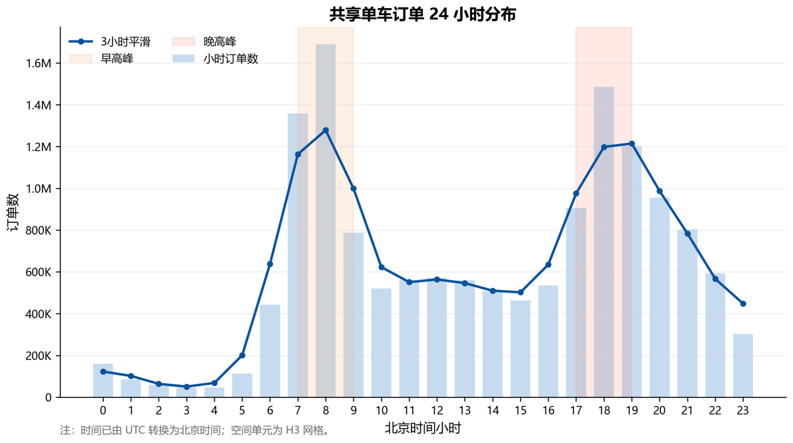

[打开原图：正文插图 3](https://chengyun249.github.io/bikeshare-demand-carbon-shenzhen/paper/images/figure_03.png)

**图3  共享单车订单 24 小时分布**

从研究设计角度看，采用全天 24 小时数据比仅分析高峰时段更有助于理解系统运行机制。仅关注高峰期虽然可以识别需求集中释放，但难以观察夜间车辆沉淀及早高峰前的供给基础；而仅分析日间数据，则可能忽略夜间净流入对次日供给结构的影响。基于这一考虑，本文将全天划分为若干关键时段，用于后续分析。

**表4  本文时段划分**

| 时段名称 | 小时范围 | 主要解释含义 |
| --- | --- | --- |
| 夜间低谷 | 0–5 时 | 夜间订单较少，用于识别车辆沉淀和净流入 |
| 早高峰前 | 6 时 | 反映早高峰开始前的供给基础 |
| 早高峰 | 7–9 时 | 通勤接驳和居住区出发需求集中释放 |
| 日间平峰 | 10–16 时 | 日常生活、商业和公共服务出行 |
| 晚高峰 | 17–19 时 | 下班通勤、轨道接驳和商业活动叠加 |
| 夜间尾段 | 20–23 时 | 夜间活动和车辆回流过程 |

需要注意的是，不同时段持续时间存在差异。例如，日间平峰覆盖时间较长，而早晚高峰持续时间相对较短。因此，在后续分析中同时区分“时段总量”和“单位小时强度”。前者反映总体贡献，后者更能体现即时供需压力。

### （二）订单空间集聚特征

从空间分布来看，共享单车订单呈现出明显的集聚特征，而非均匀分布。高订单密度主要集中在深圳西部及中南部的高活跃区域，这些区域通常与居住区、就业中心以及轨道交通和公交节点高度重合。起点订单反映的是某一网格产生出行需求的能力，而到达订单及净流入则进一步揭示车辆在空间中的转移方向。二者结合，可以更完整地理解共享单车在城市中的运行模式。

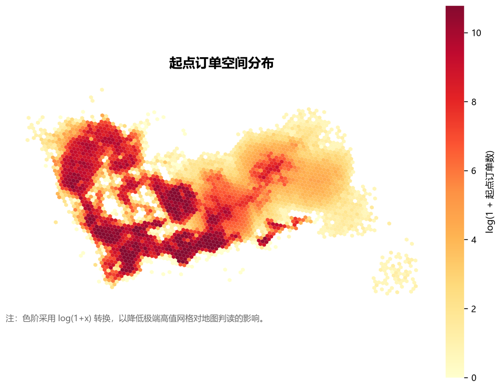

[打开原图：正文插图 4](https://chengyun249.github.io/bikeshare-demand-carbon-shenzhen/paper/images/figure_04.png)

**图 4  共享单车订单空间分布**

空间集聚结果说明，共享单车需求与城市建成环境和功能结构密切相关。高订单网格并不只是人口密集区，也可能是公共交通接驳点、产业园区、商业活动区和居住—就业转换带。该特征为后续 POI 机制分析提供了基础：若某类 POI 在高订单网格中系统性集聚，则其可能对共享单车订单强度具有解释力。

### （三）净流入与车辆沉淀代理

仅依赖出发订单难以完整刻画共享单车系统运行状态。对于共享单车而言，每一笔订单既代表需求的实现，也对应车辆的一次空间转移。因此，引入净流入指标有助于从“车辆流动”的角度理解系统运行。

当某网格在夜间持续表现为正净流入时，可以理解为该区域在订单较少的情况下仍有车辆进入，可能形成阶段性车辆沉淀；而在高峰期持续负净流入的区域，则表现为车辆被快速消耗，可能面临供给压力。需要强调的是，这里的“车辆沉淀”和“供给压力”均为基于订单流的相对判断，而非对真实库存状态的直接观测。

夜间（0—5 时）为识别车辆沉淀的重要时间窗口。相比白天，夜间订单数量较少，车辆流动更多体现为“结果状态”而非即时需求驱动。因此，在夜间持续净流入的区域，更可能反映车辆停留与空间积累。

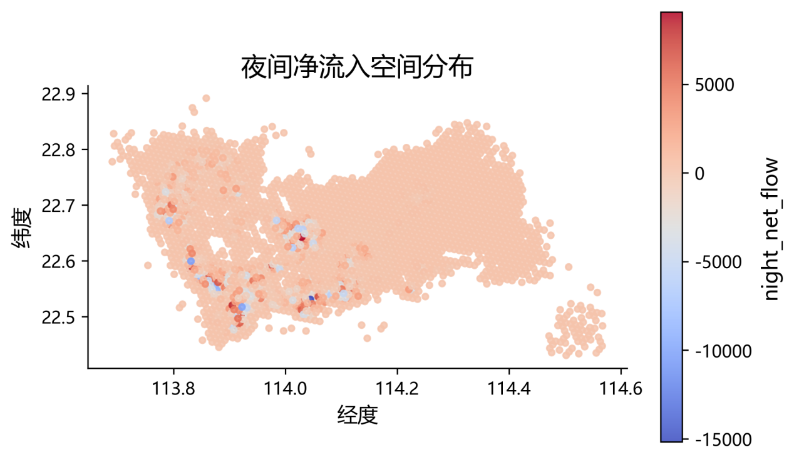

[打开原图：正文插图 5](https://chengyun249.github.io/bikeshare-demand-carbon-shenzhen/paper/images/figure_05.png)

**图 5  夜间净流入空间分布**

### （四）早高峰前供给基础

早高峰阶段是共享单车需求集中释放的重要时段，而供给是否充足，很大程度上取决于高峰开始前的车辆分布状态。基于这一考虑，本文选取 6 时作为早高峰前的关键观察时点。

结合供给状态代理可以发现：若某高需求区域在该时点具有较高供给水平，则更有可能在早高峰期间维持较好的服务能力；反之，若供给水平较低，则可能在需求快速上升时出现供给紧张。

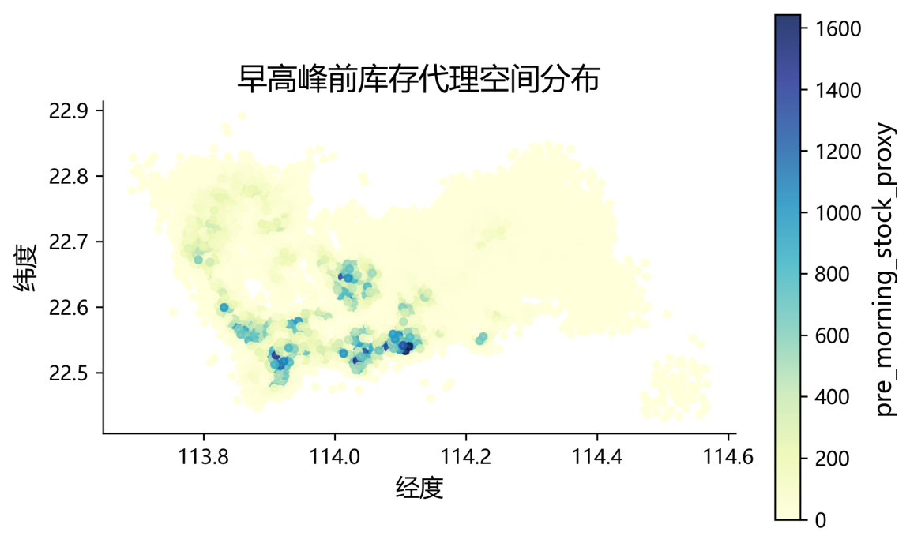

[打开原图：正文插图 6](https://chengyun249.github.io/bikeshare-demand-carbon-shenzhen/paper/images/figure_06.png)

**图 6  早高峰前库存代理空间分布**

这一指标在实际运营中具有一定参考意义。例如，对于“高需求 + 低供给”的区域，可以在夜间或清晨进行预调度；而对于夜间车辆积累明显但需求释放不足的区域，则需要进一步判断其是否属于潜在调出区域。

### （五）供给富裕与供给紧张代理

在订单流与供给状态代理基础上，本文进一步构建供给富裕与供给紧张两类代理指标。供给富裕代理主要对应库存代理较高或净流入较强的情形，可能反映车辆阶段性富余或沉淀；供给紧张代理则对应出发需求较强、净流出明显且供给代理偏低的情形。

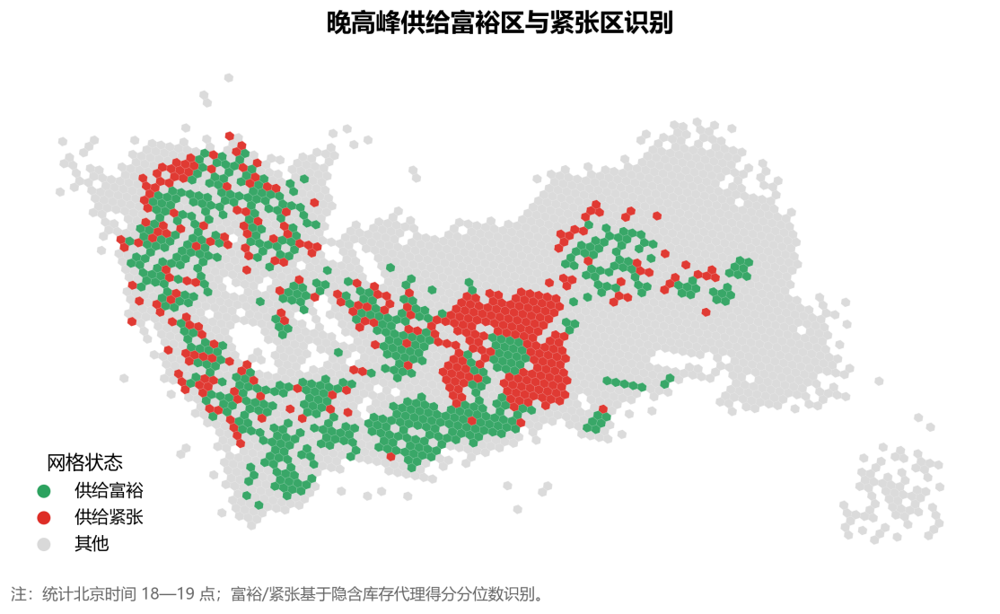

[打开原图：正文插图 7](https://chengyun249.github.io/bikeshare-demand-carbon-shenzhen/paper/images/figure_07.png)

**图 7  晚高峰供给富裕代理区与供给紧张代理区**

从空间结果来看，两类代理并不完全重合，这表明共享单车系统的供给问题并非整体性不足或过剩，而是呈现出明显的空间错配特征。

需要注意的是，供给紧张代理的解释具有一定局限性。订单数据仅反映已实现的骑行行为，无法观测无车搜索、开锁失败或用户放弃骑行等信息。因此，当某一区域订单较低时，既可能是需求不足，也可能是供给不足导致潜在需求未被实现。基于这一点，本文不将供给紧张代理直接等同于真实缺车状态，而是将其作为识别潜在问题区域的辅助线索，并在后文结合需求预测结果进行综合分析。

### （六）本部分小结

本部分从时间与空间两个维度分析了共享单车订单流特征。结果表明，订单在全天尺度上呈现出明显的周期结构，在空间上则表现为集聚分布。同时，订单流不仅反映需求，也隐含车辆在城市空间中的转移过程。

基于此，本文构建了供给状态代理，并通过夜间净流入和早高峰前状态识别车辆沉淀与供给基础。相关结果表明，在缺乏直接库存数据的情况下，订单流仍能够用于刻画供需关系的相对变化特征，并为后续分析提供基础。

## 四、POI机制与订单强度模型

### （一）POI变量与城市功能解释

共享单车需求不仅受时间影响，也与城市空间功能结构密切相关，既有深圳案例研究表明共享单车出行与建成环境之间存在明显时空关联，土地利用、城市形态和交通设施也会影响共享单车流量分布[7-8]。不同类型的功能区对应不同出行目的，例如居住区对应通勤出发，轨道交通站点对应接驳需求，而商业区则更多关联日间消费出行。为刻画这一关系，本文将高德 POI 归并为居住、办公/产业、商业消费、地铁、公交、教育、医疗、公共服务、休闲游憩和其他交通等类别，并聚合至 H3网格。

POI变量的作用主要体现在两方面：一是解释订单强度的空间差异，即哪些城市功能场所更容易产生共享单车出发订单；二是解释供给状态代理的空间差异，即哪些功能区域更容易形成车辆沉淀或供给压力。考虑到 POI 数量分布具有明显右偏特征，本文在模型中使用 log(1 + x) 变换后的 POI 变量。

需要说明的是，POI 变量之间往往存在较强相关性，例如商业消费、办公/产业、公共服务和交通设施往往共同集聚于城市中心或轨道站点周边。因此，本文更倾向于将模型结果理解为统计关联及其可能的行为解释，而不对其进行严格的因果推断。

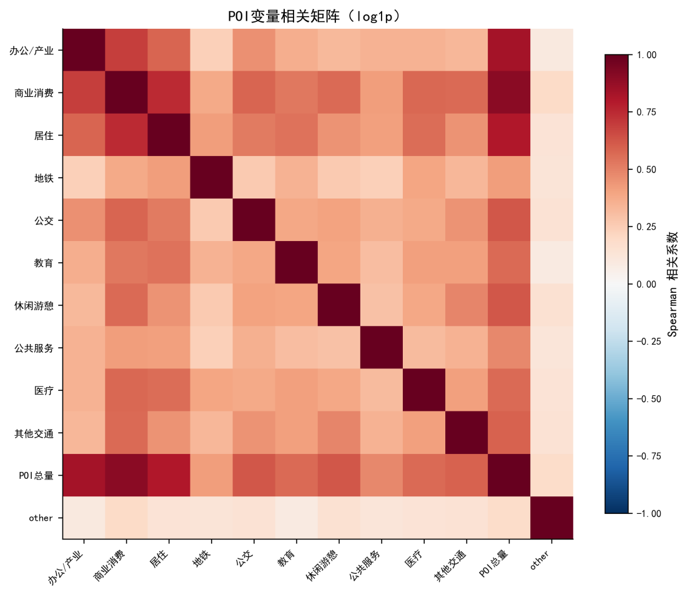

[打开原图：正文插图 8](https://chengyun249.github.io/bikeshare-demand-carbon-shenzhen/paper/images/figure_08.png)

**图 8  POI变量相关矩阵**

### （二）订单强度模型设定

共享单车出发订单是非负计数变量。若直接使用普通最小二乘模型， 可能忽略订单计数分布特征；若使用 Poisson 模型，又要求条件均值与条件方差相等，而共享单车订单往往存在过度离散。为此， 本文比较 Poisson 模型和负二项模型，并以负二项模型作为主模型[9]。

设 Yi,d,t 表示网格 i 在日期 d、小时 t 的出发订单数，LPim 表示第 m 类POI数量的对数变换值，Xi,d,t 表示时间、空间和历史订单控制变量，则订单强度模型可写为：

```math
\mathbb E[Y_{i,d,t}]=\exp\left(\beta_0+\sum_m\beta_m LP_{im}+\gamma X_{i,d,t}\right)\tag{8}
```

负二项模型允许方差高于均值，其基本形式为：

```math
\mathrm{Var}(Y_{i,d,t})=\mu_{i,d,t}+\alpha\mu_{i,d,t}^{2}\tag{9}
```

其中，μi,d,t = EYi,d,t，α为过度离散参数。当α > 0 时，模型允许订单方差大于均值，更符合共享单车高波动、强集聚的订单特征。

### （三）模型比较结果

模型比较结果表明，Poisson 模型存在明显过度离散。其 Pearson Chi-square 与自由度之比约为 5.35，明显大于 1，说明订单方差显著高于均值。负二项模型的 AIC 明显低于 Poisson 模型，说明其拟合效果更优。因此，本文后续以负二项模型作为解释订单强度的主模型。

**表5  订单强度计数模型比较**

| 模型 | 样本量 | AIC | 诊断说明 |
| --- | --- | --- | --- |
| Poisson模型 | 493,776 | 3,599,460.35 | Pearson Chi-square/df=5.35，存在过度离散 |
| 负二项模型 | 493,776 | 2,250,013.50 | AIC明显更低，作为主模型 |

这一结果表明，在共享单车订单数据中，方差明显高于均值的情况较为普遍，采用允许过度离散的模型更为合理。

### （四）POI 对订单强度影响

负二项模型结果显示，居住、公交、办公/产业、地铁及教育类 POI 与出发订单强度之间呈现稳定的正相关关系。其中，居住类 POI 反映社区出发需求和生活圈短距离出行；公交和地铁类 POI 反映公共交通接驳需求；办公/产业类 POI 反映就业活动和产业园区周边短距离通勤；教育类 POI 可能反映校园周边出行需求。

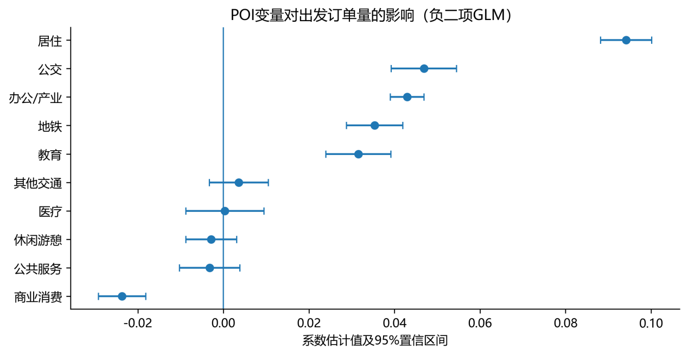

[打开原图：正文插图 9](https://chengyun249.github.io/bikeshare-demand-carbon-shenzhen/paper/images/figure_09.png)

**图 9  POI变量对出发订单强度的影响**

商业消费类 POI 在描述性比较中通常对应较高订单活跃度，但在多变量负二项模型中呈现负向净效应。该结果不宜简单解释为商业区抑制共享单车需求。 更合理的解释是：商业消费区通常与办公、交通和公共服务设施高度重合，在控制其他 POI 和时间空间因素后，商业消费变量反映的是相对于其他功能变量的边际净效应。此外，核心商业区可能存在更强步行可达性、停车约束或慢行管理限制，也可能削弱其对共享单车出发订单的净影响。因此，该结果不应被解释为商业区不需要共享单车供给，而应理解为在多变量控制条件下，商业消费 POI 相对于居住、交通和办公等变量的边际净效应较弱或方向不同。

**表 6  负二项模型中主要 POI变量结果概括**

| POI 变量 | 影响方向 | 机制解释 |
| --- | --- | --- |
| 居住 | 正向 | 居住区出发需求、社区短距离出行 |
| 公交 | 正向 | 公交接驳和短距离换乘 |
| 办公/产业 | 正向 | 就业通勤、产业园区活动 |
| 地铁 | 正向 | 轨道交通最后一公里接驳 |
| 教育 | 正向 | 校园周边短距离出行 |
| 商业消费 | 负向净效应 | 受功能共线性、步行可达性和停车约束影响，需谨慎解释 |

总体来看，POI 机制结果与订单时间分布和空间分布具有一致性。共享单车需求并非只由商业热度决定，而是由居住、就业、公共交通接驳和城市功能混合共同塑造。其中，居住和公共交通接驳是解释出发订单强度的关键机制。

### （五）POI 对供给状态代理解释

除订单强度外，本文还使用正则化 Logistic 模型分析 POI 变量对供给富裕代理和供给紧张代理的解释。由于 POI 变量属于网格层面的静态特征，而订单观测为网格—小时面板，同一网格会在不同时间段重复出现，因此该部分结果主要用于识别方向性关联，不作严格因果解释。

图10展示了不同 POI 变量对供给富裕代理和供给紧张代理的解释方向。总体来看，居住、办公/产业、地铁、教育和其他交通等 POI 对供给富裕代理具有较强解释力，说明部分居住区、就业区和交通接驳区可能在特定时段形成车辆回流、吸纳或沉淀。相比之下，供给紧张代理的解释方向相对分散，说明其形成机制可能更依赖短时需求冲击、实时库存和调度策略，而不完全由静态城市功能结构决定。

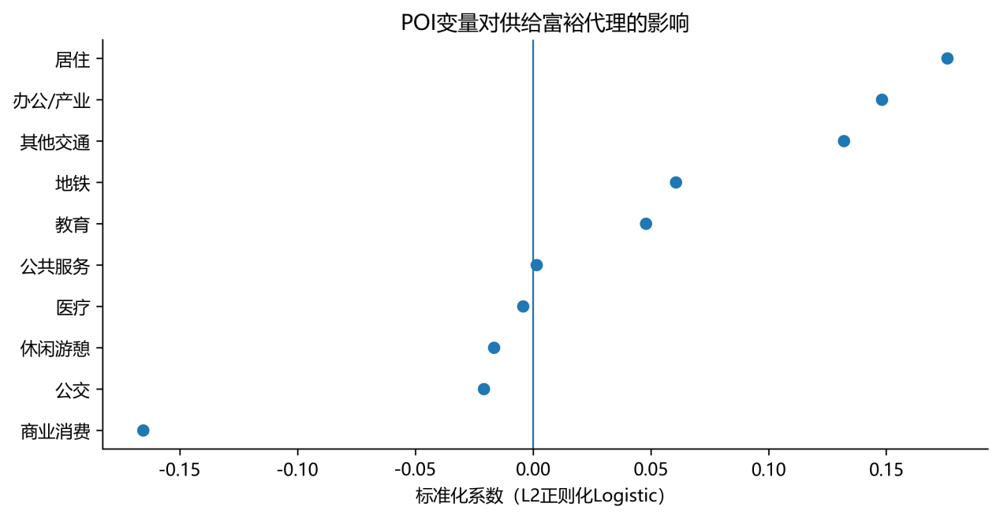

[打开原图：正文插图 10](https://chengyun249.github.io/bikeshare-demand-carbon-shenzhen/paper/images/figure_10.png)

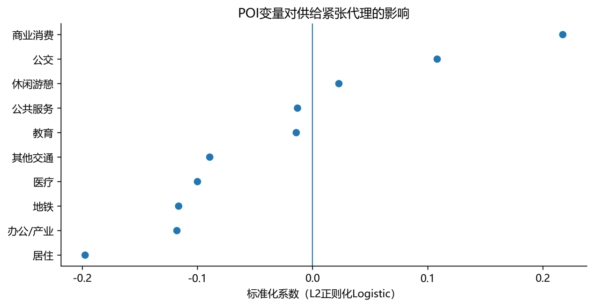

[打开原图：正文插图 11](https://chengyun249.github.io/bikeshare-demand-carbon-shenzhen/paper/images/figure_11.png)

**图 10  POI变量对供给状态代理的解释方向**

表7进一步给出了两个 Logistic 模型的整体表现。供给富裕代理模型的 ROC-AUC 约为 0.846，说明 POI 变量和控制变量能够较好地区分供给富裕代理单元与非富裕单元；供给紧张代理模型的 ROC-AUC 约为 0.655，解释力明显弱于供给富裕代理模型。

**表7  POI变量对供给状态代理的解释结果**

| 被解释变量 | 模型表现 | 解释含义 |
| --- | --- | --- |
| 供给富裕代理 | ROC-AUC约 0.846 | POI变量能较好解释车辆沉淀和阶段性供给富裕 |
| 供给紧张代理 | ROC-AUC约 0.655 | 解释力较弱，说明供给紧张更依赖实时库存和短时扰动 |

上述结果表明，车辆沉淀或阶段性供给富余更容易由稳定的城市功能结构解释，而供给紧张状态则更可能受到实时车辆库存、短时需求波动、天气、局部活动和平台调度策略等动态因素影响。因此，本文将供给紧张代理作为潜在需求缺口分析的辅助线索，而不是独立判断真实缺车的证据。

### （六）本部分小结

本部分结果表明，POI 变量与订单强度之间存在稳定的统计关联，这种关联在一定程度上与通勤及公共交通接驳行为逻辑相一致。与此同时，不同功能变量的作用呈现出明显差异，而供给状态的形成则受到空间结构与短期扰动的共同影响。

## 五、潜在需求缺口预测与情景化减碳潜力估算

### （一）潜在需求缺口预测思路

前文基于订单流与 POI 变量分析了共享单车订单强度及其城市功能关联，但需要指出的是，实际订单仅反映已经实现的骑行行为，无法直接观测潜在未被满足的需求。

在此基础上，可以引入一个更具操作性的思路：若某一网格在特定时段具备较高的历史需求基础、较强的城市功能支撑（如 POI）以及相似的时空条件，而其实际订单显著低于模型预测基准，则这一差额可以被理解为一种“需求未充分释放”的表现。基于这一逻辑，本文利用机器学习模型构建网格—小时尺度的预测需求基准[10]，并将预测值高于实际订单的正差额定义为潜在未满足需求的代理量。

需要进一步强调的是，这里的“预测需求基准”并不等同于真实潜在需求。由于模型是基于已实现订单训练得到，其刻画的更接近于既有供给约束条件下的可实现需求上界，而非完全无约束状态下的真实需求。因此，本文所识别的潜在需求缺口本质上是一种保守估计：在长期供给受限的区域，模型可能低估真实需求水平，相应地，后续减碳估算结果也偏于保守。

同时，潜在需求缺口代理并不等同于无车搜索失败或真实缺车量，而是模型意义上的正向预测残差。其主要作用在于识别可能存在需求释放空间的网格—小时单元，从而为后续情景化分析提供统一口径。

本文以网格 (i)、日期 (d)、小时 (t) 的出发订单数作为预测目标，特征变量包括 POI、时间变量、空间位置以及历史订单滞后项等。设预测需求基准为 (Di,d,t)，则潜在未满足需求代理定义为：

```math
Gap_{i,d,t}=\max\left(\widehat D_{i,d,t}-O^{out}_{i,d,t},\,0\right)\tag{10}
```

该定义保证仅在预测值高于实际订单时才记录缺口，从而避免将模型低估误判为“负需求”。

### （二）预测模型表现

在模型选择上，本文对比历史网格—小时均值基线模型、HistGradientBoosting模型和随机森林模型。为避免同一时间段信息同时出现在训练集和测试集中，本文按照日期顺序进行训练—测试划分：以2021年8月20日至8月26日作为训练期，以2021年8月27日至8月28日作为测试期。这样处理更接近实际预测场景，即利用前期订单和空间功能特征预测后续日期的网格—小时出发需求。

需要说明的是，样本在进入预测模型前经历了活跃网格筛选、稳定网格筛选、滞后特征构建和缺失样本剔除等处理，因此候选样本、训练样本与测试样本之间并非简单加总关系。最终进入预测建模的候选样本为493,776行，其中训练样本为289,215行，测试样本为109,728行。模型特征包括POI变量、网格空间位置、小时和星期变量、时段变量、历史订单滞后项、滚动订单特征、到达订单和净流入指标等。随机森林是一种基于多棵决策树的集成学习方法，能够较好处理非线性关系和变量交互[11]。

模型测试集结果如表8所示。随机森林模型在测试集上的RMSE为14.86，低于历史网格—小时均值基线模型的29.52，也低于HistGradientBoosting模型的17.13。结果表明，引入POI、历史订单、时间和空间特征后，模型能够更好刻画网格—小时订单需求波动。

**表8  潜在需求预测模型表现**

| 模型 | 测试集 RMSE | 说明 |
| --- | --- | --- |
| 历史网格—小时均值基线模型 | 29.52 | 作为基准模型 |
| HistGradientBoosting模型 | 17.13 | 机器学习对照模型 |
| 随机森林模型 | 14.86 | 测试集表现更优，作为缺口预测模型 |

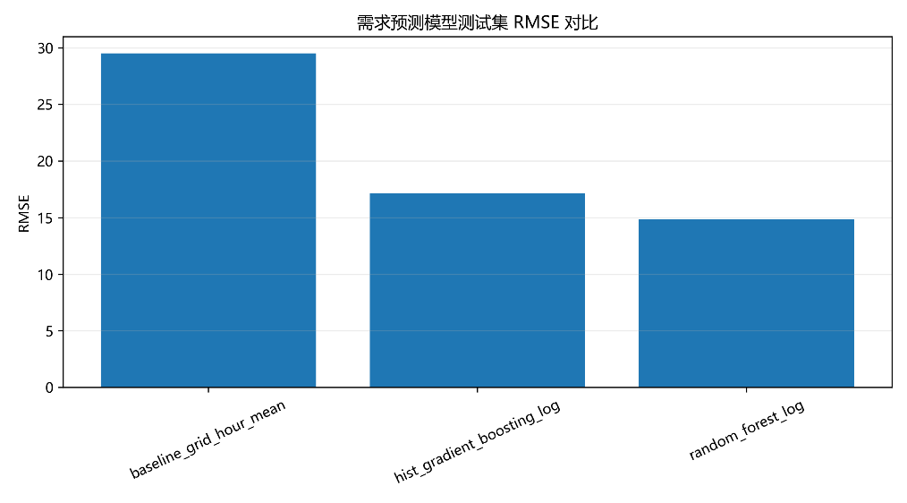

[打开原图：正文插图 12](https://chengyun249.github.io/bikeshare-demand-carbon-shenzhen/paper/images/figure_12.png)

**图11 预测模型 RMSE对比**

这一改进主要源于订单数据的非线性特征。例如，同一类 POI 在不同时间段的作用并不一致，居住区与办公区在早晚高峰的影响方向也存在差异。相较之下，机器学习模型能够更灵活地捕捉这类复杂关系。然而模型仍不可避免地受到天气变化、突发事件、道路条件及平台调度策略等未观测因素的影响。因此，本文始终将预测差额视为一种代理指标，而不将其直接解释为真实未成交需求。

### （三）潜在需求缺口的时空分布

基于随机森林模型得到预测需求基准后，本文计算各网格—小时单元的潜在未满足需求代理量。结果显示，潜在缺口主要集中于订单活跃区域和公共交通接驳较强的城市功能区，并在早晚高峰及部分日间时段表现更明显。这与前文订单流和 POI 机制分析结果基本一致，说明潜在缺口并非随机分布，而是与城市功能、历史订单基础和高峰需求释放密切相关。

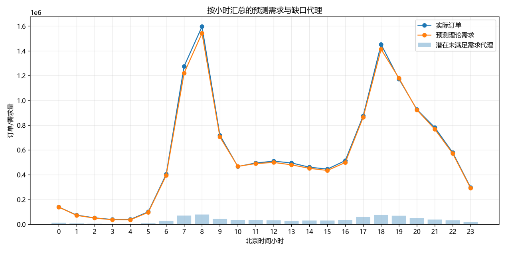

[打开原图：正文插图 13](https://chengyun249.github.io/bikeshare-demand-carbon-shenzhen/paper/images/figure_13.png)

**图 12 按小时汇总的潜在需求缺口代理**

空间分布方面，高缺口网格主要集中在深圳西部和中南部共享单车高活跃区域，尤其是居住、就业、轨道接驳和商住混合功能较强的区域。这些区域既具有较高实际订单基础，也具有较高潜在需求释放空间。对于运营治理而言，高缺口网格可作为车辆补投、早晚高峰动态调度和停车秩序优化的重点候选区域。

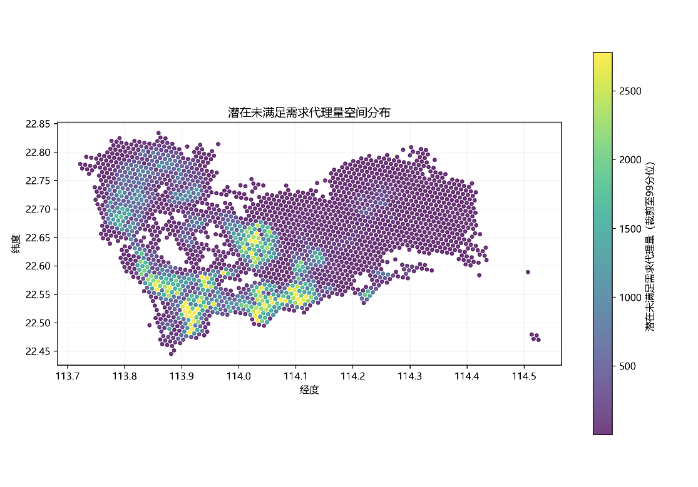

[打开原图：正文插图 14](https://chengyun249.github.io/bikeshare-demand-carbon-shenzhen/paper/images/figure_14.png)

**图13 潜在未满足需求代理量空间分布**

需要特别强调的是：空间缺口高并不必然意味着真实缺车。高缺口可能来自供给不足，也可能来自模型误差、天气扰动、局部活动、道路条件变化或平台运营策略。因此，本文在解释时更关注高缺口区域与高订单活跃区、供给紧张代理区和公共交通接驳区的重合关系，而不是孤立地把预测残差解释为缺车。

### （四）情景化减碳估算方法

潜在需求缺口本身只是一个“可能被释放的需求空间”。若要进一步评估其低碳意义，需要假设其中一部分可以通过供给优化、停车治理或调度改善转化为实际骑行[12]。

在此之前，有一个关键前提需要明确：本文隐含假设新增骑行主要替代短距离机动化出行（如网约车、私家车及部分出租车出行），因此能够产生正向减排效应。需要指出的是，若实际替代对象为步行或其他低排放方式，则本文结果可能高估减碳效果。

在该假设下，设αs表示情景 s下潜在缺口实现比例，则情景 s下新增实现骑行量为：

```math
A^s_{i,d,t}=\alpha_s Gap_{i,d,t}\tag{11}
```

若平均骑行距离为 L，单位替代减排强度为 EF，调度排放扣减为 CE，

则情景 s 下净减碳潜力为：

```math
CE_s^{net}=\sum_{i,d,t}A^s_{i,d,t}\,L\,EF-CE_s^{dispatch}\tag{12}
```

其中，$`CE_s^{net}`$ 表示净减碳潜力。本文采用1.10 km作为基准平均骑行距离，该值来自清洗后订单的订单加权平均骑行距离1.103 km，能够反映样本期深圳共享单车以短距离出行为主的特征。

**表9 情景化减碳参数设定**

| 参数 | 保守情景 | 中性情景 | 积极情景 |
| --- | --- | --- | --- |
| 潜在缺口实现比例 | 25% | 50% | 75% |
| 基准平均骑行距离 | 1.10 km | 1.10 km | 1.10 km |
| 加权替代排放强度 EF（kg CO2/km） | 0.044 | 0.062 | 0.078 |
| 调度排放扣减(吨) | 6.32 | 10.54 | 12.65 |

上述估算属于情景化潜力测算，不等同于核证减排量。原因在于： 第一，潜在缺口代理不是真实未成交订单；第二，新增骑行实际替代了何种交通方式不可直接观测；第三，调度排放扣减缺乏企业真实调度日志支撑。因此， 减碳结果适合用于比较不同情景下的潜力大小和治理优先级，而不适合直接用于碳核算申报。

### （五）情景化减碳结果

如表10所示，在 1.10 km 基准平均骑行距离下，保守、中性和积极情景的净减碳潜力分别约为 3.98 吨、18.01 吨和 41.76 吨 CO2。

**表10  1.10 km基准距离下的减碳情景结果**

| 情景 | 毛减碳潜力（吨 CO2） | 调度排放扣减（吨 CO2） | 净减碳潜力（吨 CO2） |
| --- | --- | --- | --- |
| 保守情景 | 10.30 | 6.32 | 3.98 |
| 中性情景 | 28.55 | 10.54 | 18.01 |
| 积极情景 | 54.41 | 12.65 | 41.76 |

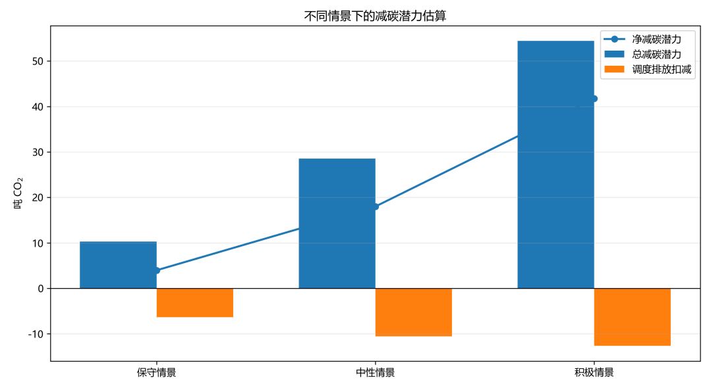

[打开原图：正文插图 15](https://chengyun249.github.io/bikeshare-demand-carbon-shenzhen/paper/images/figure_15.png)

**图14  不同情景下的减碳潜力估算**

结果表明，若通过调度和供给优化使部分潜在需求得以实现，共享单车系统可能释放一定低碳效益。随着潜在缺口实现比例提高，总减碳潜力和净减碳潜力均上升，但调度排放扣减也随之增加。

**表11  中性情景下分时段净减碳潜力**

| 时段 | 净减碳潜力（吨 CO2） | 单位小时净减碳强度（吨 CO2 /小时） |
| --- | --- | --- |
| 夜间低谷（0–5 时） | 0.93 | 0.15 |
| 早高峰前（6 时） | 0.61 | 0.61 |
| 早高峰（7–9 时） | 4.14 | 1.38 |
| 日间平峰（10–16 时） | 4.85 | 0.69 |
| 晚高峰（17–19 时） | 4.42 | 1.47 |
| 夜间尾段（20–23 时） | 3.04 | 0.76 |

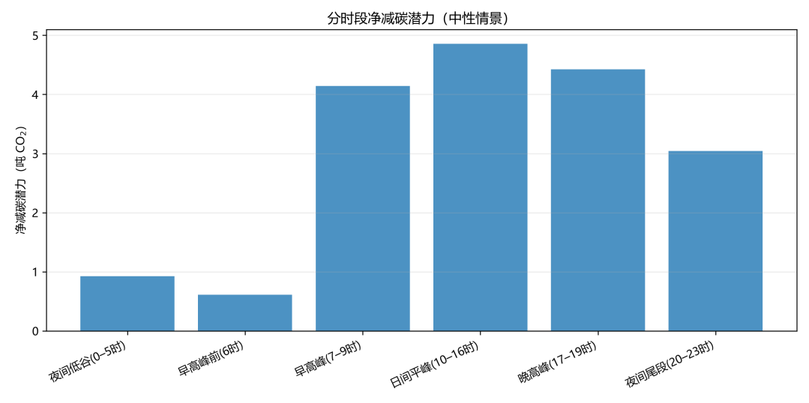

[打开原图：正文插图 16](https://chengyun249.github.io/bikeshare-demand-carbon-shenzhen/paper/images/figure_16.png)

**图15  中性情景下分时段净减碳潜力**

如图14、15所示，从分时段结果看，中性情景下日间平峰贡献的净减碳总量最高，约为4.85吨 CO2；但从单位小时强度看，晚高峰最高，约为 1.47 吨 CO2/小时。这说明，若以总量为目标，日间平峰和高峰时段均值得关注；若以单位时间效率为目标，晚高峰和早高峰更应作为调度优化重点。

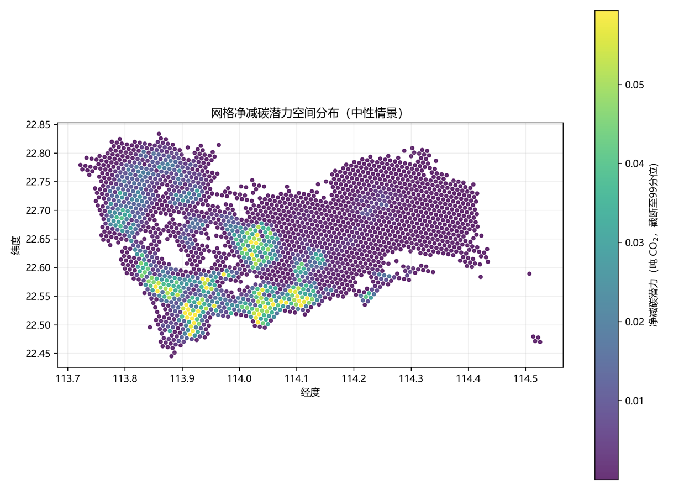

[打开原图：正文插图 17](https://chengyun249.github.io/bikeshare-demand-carbon-shenzhen/paper/images/figure_17.png)

**图16  中性情景下网格净减碳潜力空间分布**

从空间分布看，高净减碳潜力网格与潜在缺口空间分布基本一致，主要集中于共享单车高活跃区域和城市功能密集区域。这说明减碳潜力的空间格局主要由潜在需求释放空间驱动，而不是独立于需求结构产生。运营治理上，高潜在缺口且高减碳潜力的网格，可作为调度优先级和停车设施优化的重点区域。

### （六）距离敏感性分析

平均骑行距离是减碳测算中的关键参数。在其他参数保持不变的情况下，平均骑行距离越长，单位新增骑行所对应的替代里程越高，测算得到的净减碳潜力也会随之增加。为避免结论过度依赖单一距离参数，本文在采用 1.10 km 作为主结果口径的基础上，进一步开展距离敏感性分析。

本文的 1.10 km 基准距离来自清洗后订单的订单加权平均骑行距离。为检验不同距离设定下结果是否稳定，本文选取 0.94 km、1.20 km、1.73 km 和 2.00 km 作为对照距离。其中，0.94 km 和 1.73 km 分别接近样本骑行距离分布的 P25 和 P75，1.20 km 接近网格—小时平均骑行距离中位数，2.00 km 用于观察较高距离假设下的结果变化。上述距离参数仅用于稳健性检验，不改变本文以 1.10 km 为基准的主结果口径。

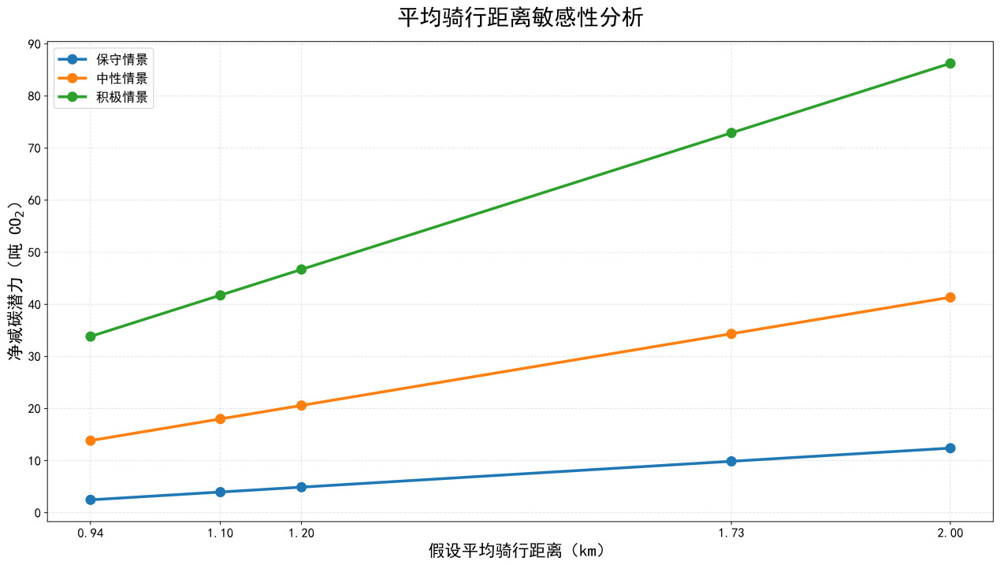

[打开原图：正文插图 18](https://chengyun249.github.io/bikeshare-demand-carbon-shenzhen/paper/images/figure_18.png)

**图17  平均骑行距离敏感性分析**

如图17所示，三类情景下的净减碳潜力均随着平均骑行距离增加而上升，整体呈现近似线性变化。这一结果符合减碳测算公式的基本逻辑，即在潜在缺口实现比例、替代排放强度和调度排放扣减不变时，平均骑行距离越长，毛减碳潜力越高。与此同时，不同距离设定并未改变三类情景之间的相对排序：积极情景始终高于中性情景，中性情景始终高于保守情景。由此说明，本文关于情景化减碳潜力的主要判断并不依赖单一距离假设，主结果具有一定稳健性。

### （七）本部分小结

本部分在订单预测基础上构建潜在需求缺口代理，并进一步通过情景分析估算减碳潜力。结果表明，潜在缺口在时间与空间上均呈现出明显结构特征，并与城市功能分布高度相关。需要再次强调，这一结果应被理解为一种潜力估算，而非对真实未满足需求或实际减排量的直接测量。

## 六、结论、建议与研究局限

### （一）主要结论

本文基于深圳共享单车订单数据与 POI 数据，从订单流特征、城市功能关联及需求预测三个层面，对共享单车供需关系进行了系统分析。

第一，深圳共享单车订单具有明显全天周期和空间集聚特征。订单在0–5 时处于低谷，7–9 时形成早高峰，17–19 时形成晚高峰。空间上，订单主要集中于深圳西部和中南部高活跃区域，说明共享单车需求与居住、就业、公共交通接驳和城市功能混合密切相关。

第二，基于订单流构建供给状态代理是可行的。出发订单、到达订单和净流入不仅反映需求，也反映车辆空间再分布方向。夜间净流入和早高峰前库存代理能够揭示车辆沉淀与供给基础，晚高峰供给状态代理则揭示局部供需错配。但这些指标均为代理状态，不等同于真实库存或真实缺车。

第三，POI城市功能变量对共享单车订单强度具有显著解释力。负二项模型优于 Poisson 模型，说明订单计数存在明显过度离散。模型结果显示，居住、 公交、办公/产业、地铁和教育类 POI 对出发订单强度呈正向影响，说明社区出发、公共交通接驳和就业活动是共享单车需求的重要来源。

第四，预测模型可以用于构建潜在未满足需求代理。随机森林模型测试集 RMSE 低于历史均值基线，能够较好刻画网格—小时订单波动。本文将预测需求基准高于实际订单的正差额定义为潜在需求缺口代理，该指标主要集中在高活跃接驳区和城市功能密集区域。

第五，共享单车潜在需求释放具有一定情景化减碳潜力。在 1.10 km 基准距离下，保守、中性和积极情景的净减碳潜力分别约为 3.98 吨、18.01 吨和 41.76 吨 CO2。分时段看，日间平峰贡献总量较高，晚高峰单位小时强度最高；空间上，高减碳潜力区域与高潜在缺口区域基本一致。

### （二）政策建议

第一，建议逐步建立基于网格—小时尺度的共享单车精细化监测体系。相比传统以行政区或日均订单量为主的管理方式，这种细粒度的监测模式，更有助于及时识别局部区域的车辆沉淀问题和高峰期的供给压力，进而提升调度决策的针对性和有效性。建议可基于H3网格或类似空间单元，持续监测出发订单、到达订单、净流入、车辆库存及用户需求反馈等关键指标，为后续管理提供精准数据支撑。

第二，建议实施分时段差异化调度策略。夜间低谷时段，可重点识别车辆沉淀区域并提前安排预调度工作，为次日出行高峰做好准备；早高峰来临前，建议重点检查居住区和轨道站点周边的车辆供给基础，保障居民通勤出行需求；晚高峰前，则可重点关注办公/产业区、商业区及各类接驳节点的车辆可用性，满足用户返程出行需求。同时，对于单位小时减碳强度较高的高峰时段，建议优先保障车辆供给，更好发挥共享单车的低碳价值[13]。

第三，建议将POI城市功能特征纳入车辆投放与调度决策中。实践表明，居住、公交、地铁和办公/产业类POI对订单强度具有明显的解释力，这也说明车辆调度不应仅依赖历史订单量数据，还应充分结合城市功能场所的分布特点和时段规律。例如，居住区可重点保障早高峰出发需求，轨道和公交站点可重点保障接驳需求，办公区则可重点关注晚高峰出发需求，实现供给与需求的精准匹配。

第四，建议优先治理高潜在缺口和高减碳潜力的网格区域。从空间分布来看，潜在缺口和净减碳潜力具有明显的集聚特征。对此，建议对高需求缺口且高减碳潜力的区域，优先配置车辆补投、停车空间及运维资源，着力缓解供需矛盾；对车辆供给富裕但需求释放不足的区域，则可将其作为车辆输出区，或重点开展停车秩序优化工作，提升资源利用效率。

第五，建议谨慎使用共享单车减碳相关结果。需要说明的是，本文所呈现的减碳结果属于情景化潜力估算，暂不建议直接用于碳交易、碳普惠核证或正式减排申报等场景。若要形成可核证的减排量，还需进一步补充用户替代方式调查、车辆真实调度轨迹、车辆全生命周期排放及企业运维能耗等相关数据，确保减碳结果的准确性和合规性。

### （三）研究局限

受各方面条件的限制，本文仍存在若干局限：

第一，缺乏实时车辆库存数据。本文使用订单净流入构造隐含库存代理，但该指标无法完全替代真实可用车辆数。未来若能获得车辆位置快照或停车点库存数据，可进一步验证供给状态代理的准确性。

第二，缺乏无车搜索和开锁失败数据。本文潜在需求缺口来自预测需求基准与实际订单之间的正差额，可能包含模型误差和未观测扰动。若能获取用户搜索、附近无车提示和开锁失败日志，可更准确识别真实未满足需求。

第三，样本时间窗口较短。本文主分析样本为 2021年8月20日至8月28日，共9个完整分析日，虽然订单规模较大，但难以覆盖季节变化、天气冲击和节假日效应。后续研究可扩展更长时间跨度，并引入天气、地铁客流和节假日变量。

第四，减碳估算依赖情景参数。本文采用数据驱动的 1.10 km 平均骑行距离，并进行距离敏感性分析，但交通方式替代比例和调度排放仍属于假设。未来可结合用户出行调查和企业调度日志，提高减碳估算精度。

### （四）研究展望

在现有研究基础上，未来研究可从三个方向拓展。

第一，将订单数据与实时车辆库存、车辆轨迹和停车点状态结合，构建更接近真实供需关系的动态模型。

第二，引入天气、轨道客流、道路网络和用户端搜索日志，提高潜在需求识别能力。

第三，在真实调度约束下建立“服务水平—调度成本—净减碳效益”的多目标优化模型，从而将本文的代理识别框架进一步转化为可执行的运营决策方案。

总体而言，本文说明共享单车供给优化不仅是运营效率问题，也与城市低碳交通潜力释放密切相关。基于订单流、POI机制和预测缺口构建代理分析框架，可以为共享单车调度治理、公共交通接驳优化和低碳城市交通政策提供参考，也为后续将数据分析结果转化为实际运营决策提供了一种可复现路径。
